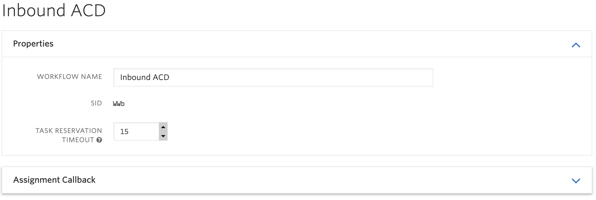
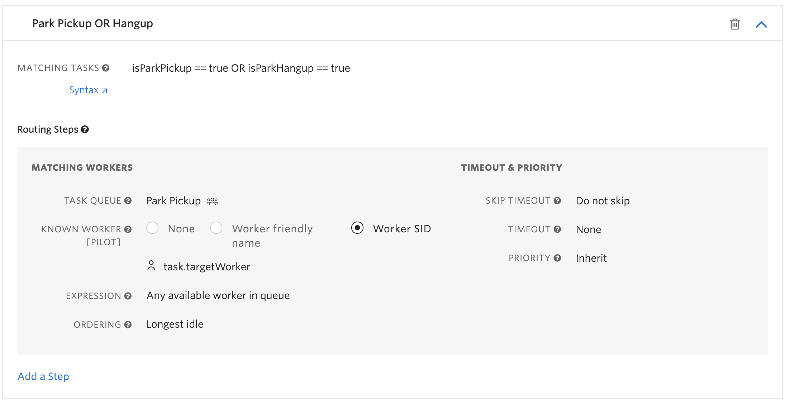
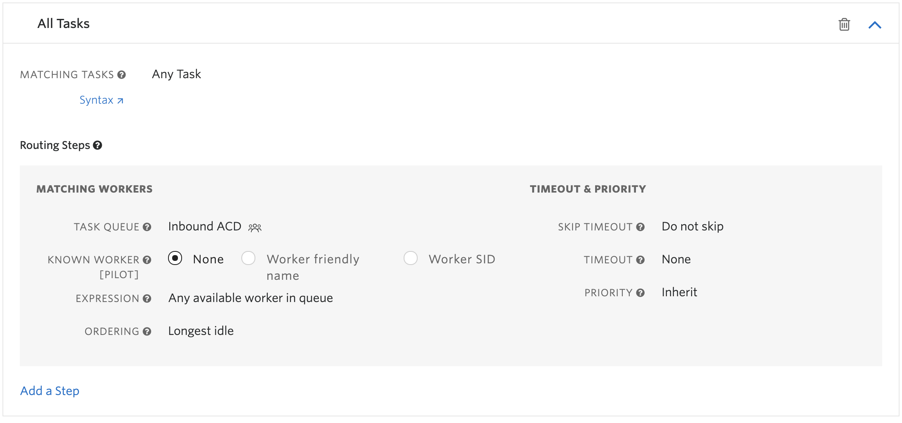
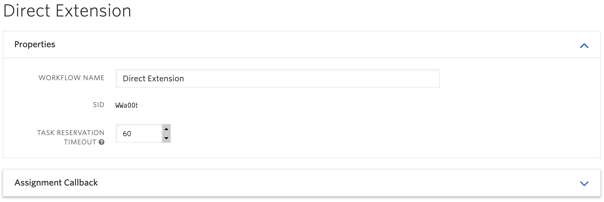
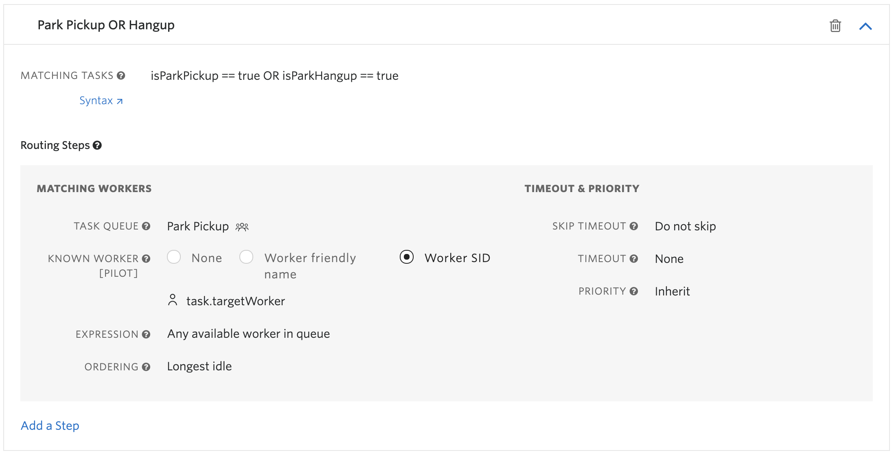
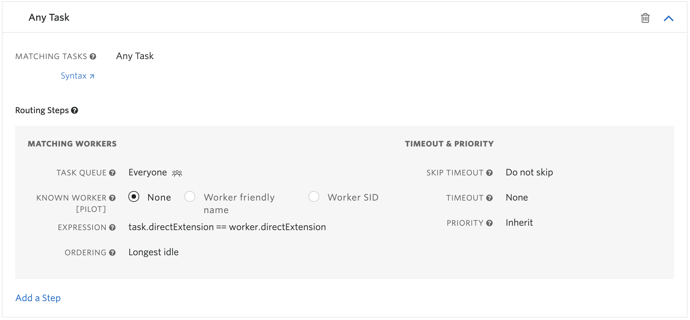

# Flex Multi-Call Handling
## Disclaimer
**This software is to be considered "sample code", a Type B Deliverable, and is delivered "as-is" to the user. Twilio bears no responsibility to support the use or implementation of this software.**

## Overview
The native Flex UI only supports handling a single voice call task at a time. If a TaskRouter worker's voice task is increased beyond 1 and they accept a second incoming voice task, they will prompted to accept the new incoming call which will disconnect the current active call.

This sample solution attempts to address this limitation and allow a worker to accept an incoming voice task while they already have an active voice call, without losing that active voice call.

## Primary Use Case 
This sample solution was built with a very specific use case in mind: allowing a worker to receive direct calls while on any other type of call.

In many contact center environments, it's common for a worker to have a direct extension or external number and want to be able to answer those direct calls even if they are currently handling another call. That is the scenario this sample solution is attempting to solve for.

## Business Logic Assumptions
In support of the primary use case, the following business logic assumptions have been made:

* Inbound queue calls (ACD calls), or calls that are routed to a group of agents instead of one specific agent, are treated differently than direct calls to a specific worker
* Workers are only allowed to handle a single ACD call at a time, so they won't be routed another ACD call if they already have one assigned
* Workers are only allowed to receive an ACD if they don't have any other active call. So if they are already on a direct call or an outbound call, they will not receive an ACD call

## Not Included Features
This sample solution provides the basics for demonstrating this use case. It does not cover some natural extensions of this use case such as:

* Validating the worker extension entered in the IVR. Callers that enter an invalid extension will sit on hold indefinitely until they hang up since there is no matching worker to route the call to.
* Preventing a rejected direct call task from immediately routing back to the target worker. Additional logic would be required to do something when the task is rejected, such as updating the call wth TwiML to play a "Please try your call again later" message.
* Voicemail option for direct calls to workers that are not available
* Sending a direct call to voicemail if the targeted worker does not answer or rejects the task
* Visual presentation of a worker's voicemails

## Impact to Flex Realtime Queue View
Since call tasks transferred in Flex to a TaskQueue only use TaskQueue expressions to determine eligible workers, it's necessary to use a worker attribute to control whether a worker should be able to receive a queue (ACD) call (see Business Logic Assumptions above).

This means that when a worker is not eligible to receive an ACD call because they have another call already, they will be removed from the TaskQueue and will not be part of the TaskQueue worker count on the Flex Realtime Queue View.

Also, when an active call is parked so an incoming call can be answered, that call will not show up as an active call on any TaskQueues since there is no task associated with the call while it is parked.

When a parked call is picked up, it will show up as an active call on the "Park Pickup" TaskQueue. The reasoning for this is explained below.

## Pre-Requisites
* An active Twilio account with Flex provisioned. Refer to the [Flex Quickstart](https://www.twilio.com/docs/flex/quickstart/flex-basics#sign-up-for-or-sign-in-to-twilio-and-create-a-new-flex-project") to create one.
* npm version 5.0.0 or later installed (type `npm -v` in your terminal to check)
* Node.js version 12 or later installed (type `node -v` in your terminal to check)
* [Twilio CLI](https://www.twilio.com/docs/twilio-cli/quickstart#install-twilio-cli) along with the [Flex CLI Plugin](https://www.twilio.com/docs/twilio-cli/plugins#available-plugins) and the [Serverless Plugin](https://www.twilio.com/docs/twilio-cli/plugins#available-plugins). Run the following commands to install them:
  
  ```bash
  # Install the Twilio CLI
  npm install twilio-cli -g
  # Install the Serverless and Flex as Plugins
  twilio plugins:install @twilio-labs/plugin-serverless
  twilio plugins:install @twilio-labs/plugin-flex
  ```

## Twilio Serverless Functions and Assets
Some of the following setup steps will require Serverless Functions URLs, so we will deploy the Twilio Serverless Functions before proceeding with the remaining steps.

### Environment Variables
Login to your Twilio Console and capture the following account settings for use in serverless function environment variables:

| Variable Name | Description |
| :---------------- | :-------------------- |
| WORKSPACE_SID     | Your Flex Task Assignment workspace SID. Find this in the [TaskRouter Workspaces](https://www.twilio.com/console/taskrouter/workspaces) page. |
| SYNC_SERVICE_SID  | Your Sync "Default Service" SID. Find this in the [Sync Services](https://www.twilio.com/console/sync/services) page.

### Setup
1. Clone this repo to your local development environment
1. Change to the `serverless/multi-call-handling` directory and install the dependencies
    ```bash
    cd serverless/multi-call-handling

    npm install
    ```
1. Copy the `.env.sample` file to `.env`
    ```bash
    cp .env.sample .env
    ```
1. Edit `.env` and replace the environment variables with the values you captured in the "Twilio Account Settings" section above
    ```bash
    WORKSPACE_SID=WSXXXXXXXXXXXXXXXXXXXXXXXXXXXXXXXX
    SYNC_SERVICE_SID=ISXXXXXXXXXXXXXXXXXXXXXXXXXXXXXXXX
    ```

### Deploy
1. Verify your Twilio CLI is using the Twilio Flex account you want to test with. Run the following command and note which Twilio account has `Active` as `true`
    ```bash
    twilio profiles:list
    ```
1. If you need to change the active Twilio account, run the following command with the desired profile name
    ```bash
    twilio profiles:use PROFILE
    ```
1. If you do not yet have a Twilio CLI profile for the desired Twilio Flex account, run the following command to connect to that account and give it your desired profile name
    ```bash
    twilio profiles:create --profile=PROFILE
    ```
1. With your desired Twilio Flex account profile active in the Twilio CLI, change to the `serverless/multi-call-handling` directory and deploy the Twilio Serverless Functions and Assets
    ```bash
    cd serverless/multi-call-handling

    twilio serverless:deploy
    ```
1. When the deployment completes, copy the following Deployment Details that will be used in subsequent setup and configuration steps
    * `Domain`
    * `Functions` URL that ends in `/call-status-handler`

## Twilio Account Configuration
This section outlines the required configuration in your Twilio Flex account for this sample solution to operate as intended. Login to your [Twilio Console](https://www.twilio.com/console) and follow the steps in each section below.

### TaskRouter TaskQueues
1. Navigate to TaskRouter -> Workspaces -> Flex Task Assignment -> Task Queues
1. Create a new TaskQueue called "Inbound ACD" that will handle all inbound queue calls that are not intended for a specific worker
    1. For the "Queue Expression" use the following:
        * `isAcdReady == true`
        * This expression will allow precise control of when a worker should receive ACD calls by modifying the `isAcdReady` worker attribute
    1. Leave all other configuration fields at their default values
1. Create a new TaskQueue called "Park Pickup" that will be used for routing calls back to the target worker when they pick them up from being parked
    1. For the "Queue Expression" use the following:
        * `1 == 1`
        * This ensures any worker is eligible to receive calls in this queue. We will use Workflow worker expressions to only target the worker picking up the call.

### TaskRouter Workflows
1. Navigate to TaskRouter -> Workspaces -> Flex Task Assignment -> Workflows
2. Create a new Workflow called "Inbound ACD"
    1. Set the Task Reservation Timeout to 15 seconds (a common timeout for ACD calls to minimize re-routing delay if a targeted worker doesn't accept the reservation)
    1. Add a Filter named "Park Pickup OR Hangup"
        1. Set the "Matching Tasks" expression to:
            * `isParkPickup == true OR isParkHangup == true`
        1. Under the "Routing Step", set the following:
            * Task Queue to `Park Pickup`
            * Known Worker to `Worker SID`
            * Task Field with Worker SID to `task.targetWorker`
            * Leave all other fields at their default values
    1. Add a Filter named "Any Task"
        1. Set the "Matching Tasks" expression to:
            * `1 == 1` (Will display as `Any Task`)
        1. Under the "Routing Step", set the following:
            * Task Queue to `Inbound ACD`
            * Leave all other fields at their default values





3. Create a new Workflow called "Direct Extension"
    1. Set the Task Reservation Timeout to 60 seconds (it's common to allow workers more time to pickup direct calls since the call will not route to any other workers)
    1. Add a Filter named "Park Pickup OR Hangup"
        1. Set the "Matching Tasks" expression to:
            * `isParkPickup == true OR isParkHangup == true`
        1. Under the "Routing Step", set the following:
            * Task Queue to `Park Pickup`
            * Known Worker to `Worker SID`
            * Task Field with Worker SID to `task.targetWorker`
            * Leave all other fields at their default values
    1. Add a Filter named "Any Task"
        1. Set the "Matching Tasks" expression to:
            * `1 == 1` (Will display as `Any Task`)
        1. Under the "Routing Step", set the following:
            * Task Queue to `Everyone`
            * Expression to `task.directExtension == worker.directExtension`
            * Leave all other fields at their default values





### TaskRouter Worker Extensions
To support the primary use case of workers receiving direct calls to them while they're on another call, we will need to create a `directExtension` attribute on each worker we want to test. The "Direct Extension IVR" sample Studio Flow is designed to support 4 digit extensions.

With that in mind let's configure at least one test worker.

1. Navigate to TaskRouter -> Workspaces -> Flex Task Assignment -> Workers
1. Click on the first worker you want to test with
1. In the attributes JSON object, add a `"directExtension"` property with a 4 digit string, for example:
    ```json
    { ...,
      "directExtension": "1234",
      ...
    }
    ```
1. Save the changes to that worker and navigate back to the Workers list
1. Repeat the previous two steps for all other workers you want to test with, being careful not to assign the same extension to more than one worker

### Studio Flows
1. Navigate to Studio -> Flows
1. Create a new Flow called "Inbound ACD IVR"
    1. Select template "Import from JSON"
    1. Copy the [inbound-acd-ivr](studio/inbound-acd-ivr.json) sample Studio JSON from the [studio](studio/) folder of this repo
    1. Paste the JSON into the New Flow dialog, overwriting anything already there, and click Next
    1. Select the "SendToFlex" widget and perform the following:
        1. Click the Workflow dropdown and select `Inbound ACD`
        1. Click the Channel dropdown and select `Voice`
        1. Click the Save widget button
    1. Click the Publish button at the top of the Flow and Publish again on the "Publish Flow?" dialog that pops up
1. Create a new Flow called "Direct Extension IVR"
    1. Select template "Import from JSON"
    1. Copy the [direct-extension-ivr](studio/direct-extension-ivr.json) sample Studio JSON from the [studio](studio/) folder of this repo
    1. Paste the JSON into the New Flow dialog, overwriting anything already there, and click Next
    1. Select the "SendToFlex" widget and perform the following:
        1. Click the Workflow dropdown and select `Direct Extension`
        1. Click the Channel dropdown and select `Voice`
        1. Click the Save widget button
    1. Click the Publish button at the top of the Flow and Publish again on the "Publish Flow?" dialog that pops up

### Phone Numbers
1. Navigate to Phone Numbers -> Manage -> Active Numbers
    * If you already have two phone numbers to test with, proceed to the next step
    * If not, [purchase additional numbers](https://support.twilio.com/hc/en-us/articles/223135247-How-to-Search-for-and-Buy-a-Twilio-Phone-Number-from-Console) as necessary until you have two numbers for testing this solution
1. Click on the phone number you would like to use for inbound ACD calls and update the following:
    1. Under the "Voice and Fax" section, click the dropdown under "A Call Comes In" and select "Studio Flow"
    1. Click the Studio Flow dropdown and select "Inbound ACD IVR"
    1. In the "Call Status Changes" field, enter the Serverless Functions URL ending in `/call-status-handler` you copied during the Serverless Functions Deploy section above
    1. Save these changes and go back to the list of Active Numbers
1. Click on the phone number you would like to use for Direct Extension calls and update the following:
    1. Under the "Voice and Fax" section, click the dropdown under "A Call Comes In" and select "Studio Flow"
    1. Click the Studio Flow dropdown and select "Direct Extension IVR"
    1. In the "Call Status Changes" field, enter the Serverless Functions URL ending in `/call-status-handler` you copied during the Serverless Functions Deploy section above
    1. Save these changes. Your numbers are now ready for testing.

## Twilio Flex Plugins
This section will go through the steps to prepare the Flex plugins in this sample solution for use in your development environment and deployment to your Flex account.

### Plugin Description
#### **plugin-shared-services**
Timing of events in this solution is critical for proper operation. For example, when a worker is completing a task, their voice task channel capacity and `isAcdReady` worker attribute must be updated correctly before the task is allowed to be completed.

Since it's possible for two plugins attempting to update worker attributes at the same time to conflict with each other, resulting in one plugin's updates being overridden by another, this sample solution introduces the concept of a shared services plugin.

Routing worker attribute updates through this plugin instead of each plugin updating the worker attributes separately ensures simultaneous attribute updates are handled sequentially and will not conflict with each other.

#### **plugin-multi-call-handling**
This is the core plugin of the sample solution. All frontend facing logic and interface components for managing multiple active calls is contained here.

### Setup
1. Navigate to the `plugin-shared-services` directory, install dependencies, copy the `.env.sample` and `public/appConfig.example.js` files
    ```bash
    cd plugin-shared-services

    npm install

    cp .env.sample .env

    cp public/appConfig.example.js public/appConfig.js
    ```
1. Edit the `.env` file and populate `REACT_APP_SERVERLESS_DOMAIN` with the Domain value you copied in the Serverless Functions Deploy section above
    ```bash
    REACT_APP_SERVERLESS_DOMAIN=multi-call-handling-1234-dev.twil.io
    ```
1. Navigate to the `plugin-multi-call-handling` directory, install dependencies, copy the `env.sample` and `public/appConfig.example.js` files
    ```bash
    cd ../plugin-multi-call-handling

    npm install

    cp .env.sample .env

    cp public/appConfig.example.js public/appConfig.js
    ```
1. Edit the `.env` file and populate `REACT_APP_SERVERLESS_DOMAIN` with the Domain value you copied in the Serverless Functions Deploy section above
    ```bash
    REACT_APP_SERVERLESS_DOMAIN=multi-call-handling-1234-dev.twil.io
    ```

### Development
Since this sample solution requires both Flex plugins to be running, and more specifically for `plugin-shared-services` to be loaded before `plugin-multi-call-handling`, the following steps are required the first time you are setting up this solution before you can start testing it locally.

1. Navigate to `plugin-shared-services` and start the plugin
    ```bash
    cd plugin-shared-services

    twilio flex:plugins:start
    ```
1. After the plugin finishes compiling and launches your browser to localhost:3000, close your browser tab and stop the plugin web server by pressing `Ctrl + c`
1. Navigate to `plugin-multi-call-handling` and start the plugin
    ```bash
    cd ../plugin-multi-call-handling

    twilio flex:plugins:start
    ```
1. After the plugin finishes compiling and launches your browser to localhost:3000, close your browser tab and stop the plugin web server by pressing `Ctrl + c`

Now that both plugins have been run once, the Twilio CLI is aware of them and they can be run together. Anytime you want to test this sample solution locally, you just need to run the following from any directory to start them together and ensure they are loaded by the Flex UI in the right order:

```bash
twilio flex:plugins:start --name plugin-shared-services --name plugin-multi-call-handling
```

Once you login to Flex running on your local dev environment at `localhost:3000`, the Flex UI will load plugins in the order they are listed after the `twilio flex:plugins:start` command. At that point you are ready to test and further develop the Flex plugins.

### Deploy
Once you are happy with your plugin, you have to deploy then release the plugin for it to take affect on Twilio hosted Flex.

1. Verify your Twilio CLI is using the Twilio Flex account you want to test with. Run the following command and note which Twilio account has `Active` as `true`
    ```bash
    twilio profiles:list
    ```
1. If you need to change the active Twilio account, run the following command with the desired profile name
    ```bash
    twilio profiles:use PROFILE
    ```
1. Navigate to the `plugins-shared-services` directory and deploy the plugin
    ```bash
    cd plugin-shared-services

    twilio flex:plugins:deploy --major --changelog "Notes for this version" --description "Functionality of the plugin"
    ```
1. Note the plugin version returned after it's deployed, for example `plugin-shared-services@1.0.0`
1. Navigate to the `plugin-multi-call-handling` directory and deploy the plugin
    ```bash
    cd ../plugin-multi-call-handling

    twilio flex:plugins:deploy --major --changelog "Notes for this version" --description "Functionality of the plugin"
    ```
1. Note the plugin version returned after it's deployed, for example `plugin-multi-call-handling@1.0.0`
1. Create a release to enable these two newly deployed plugins, ensuring `plugin-shared-services` is defined first in the release list
    ```bash
    twilio flex:plugins:release --plugin plugin-shared-services@1.0.0 --plugin plugin-multi-call-handling@1.0.0 --name "Name for this release" --description "Description of this release"
    ```

After you've deployed and released your plugins, you can confirm they are enabled in the Flex Admin Plugins dashboard at https://flex.twilio.com/admin/plugins.

For more details on deploying your plugin, refer to the [Flex plugin deploy and release guide](https://www.twilio.com/docs/flex/developer/plugins/cli/deploy-and-release).

Note: Common packages like `React`, `ReactDOM`, `Redux` and `ReactRedux` are not bundled with the build because they are treated as external dependencies so the plugin will depend on Flex to provide them globally.

## Testing
Once the Twilio Serverless Functions and Assets are deployed, the account configurations are complete, and both plugins are either running in your local development environment or in your hosted Flex instance, you are ready to test the solution.

### Picking up a Second Incoming Call
1. Login to the Flex UI (either your local dev or hosted Flex instance, depending on where the plugins are running)
1. Change your activity to Available
1. Place a call to the Twilio number routing to your "Inbound ACD IVR" Studio Flow
1. Accept the incoming voice task and wait for the call to connect with your browser WebRTC client
1. While that call is active, place a second call, this time to the Twilio number routing to your "Direct Extension IVR" Studio Flow
1. When the IVR asks for the 4 digit extension of the person you would like to call, enter the `directExtension` value for the worker you're testing with
1. Accept the incoming voice task, at which point the following should happen:
    1. The first caller starts hearing hold music
    1. That call shows up in the "Parked Calls" list in the Flex Task List
    1. The task associated with the first call is automatically completed
    1. The second voice task is accepted and connects with your browser WebRTC client
1. To switch between calls, double click on the call in the "Parked Calls" list. At that point the following should happen:
    1. The item in the "Parked Calls" list disappears and a new voice task shows up in the Flex Task List
    1. The second caller starts hearing hold music and that call shows up in the "Parked Calls" list in the Flex Task List
    1. The new voice task associated with the first caller is automatically accepted and the call connected with your browser WebRTC client
    1. The task associated with the second call is automatically completed
1. You can continue to switch between the two calls as necessary by simply double clicking on the parked call you want to pick up

### Parking an Active Call to Place an Outbound Call
1. Login to the Flex UI (either your local dev or hosted Flex instance, depending on where the plugins are running)
1. Either place a call to the Twilio number routing to your "Inbound ACD IVR" Studio Flow and accept the voice task, or [place an outbound call from the Flex dialpad](https://www.twilio.com/docs/flex/end-user-guide/dialpad-use)
1. Once the call is active with your browser WebRTC client, click the Park Button  on the task item in the Flex Task List. That should cause the following to happen:
    1. Hold music will begin playing to the caller / called party
    1. The call shows up in the "Parked Calls" list in the Flex Task List
    1. The task associated with the call is automatically completed
1. Place an outbound call from the Flex dialpad. Normally the dialpad is disabled when you have an active voice task, so parking the active call allows you to use the dialpad while that call is parked.
1. Once that call connects, switching between the active calls is the same as in the previous test, simply double click on the parked call to pick it up and automatically park your current active call

## Hold Music
When a call is parked, the Call SID is updated with the following TwiML instruction:

```xml
<Response>
  <Play loop="99">https://{your-serverless-domain}/hold_music_1.mp3</Play>
</Response>
```

If you'd like to change the hold music the caller hears, you can simply replace `serverless/multi-call-handling/assets/hold_music_1.mp3` with the desired MP3 audio file and re-deploy the Twilio Serverless Functions and Assets.

If you want to modify the TwiML instruction, such as to randomize the hold music or loop through multiple audio files, that logic is controlled in the `serverless/multi-call-handling/functions/park-call.js` file.